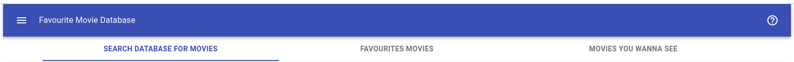
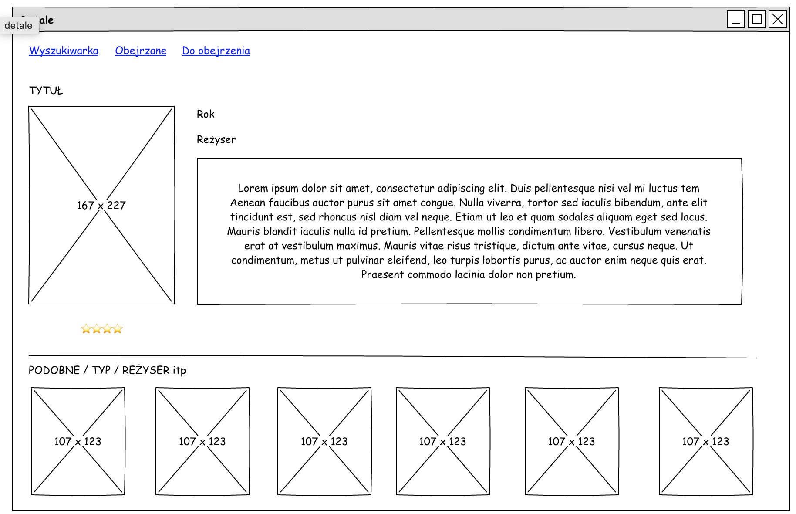

# Movies



This is an app that allows You to search for movies in database and rate them or save on 'wanna see' list.
You can switch between the lists and search on top menu.
You can always click on every movie to see its detailed information.
This app has been prepared for "Coderslab: React, Redux for programmers" online course.

# Task Objectives

Use http://omdbapi.com/ API

Main functionality:

- search for movies
- site with detailed informations about selected movie
- site with list of rated movies
- site with list of 'wanna see' movies
- user can rate movies or add them to 'wanna see' list
- user can see detailed info about chosen movie
- user can delete movies from lists or move them from one to another list
- user can sort rated and 'wanna see' movies alphabetically, by year or by rating
- user can filter movies to show movies, series, episodes
- user can change rating of the already rated movie
- movie cannot be on both list at once

You should use React with Redux. Any other libraries are most welcome.





# Downloading code and running on your machine

Make sure You installed the latest version of [Git](https://git-scm.com/downloads) and [NodeJS with npm](https://nodejs.org/en/download/).
Open your terminal, enter the folder of your choice or create new one and type:
```
git clone https://github.com/cerassus/movies-react.git
cd movies-react
npm install
npm start
```
Open your browser and enter the address "localhost:3001"

# Website link on the server

https://movies.cerassus.eu/

# Used Technologies


